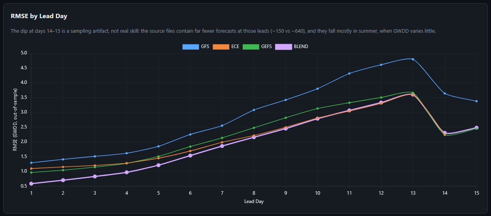
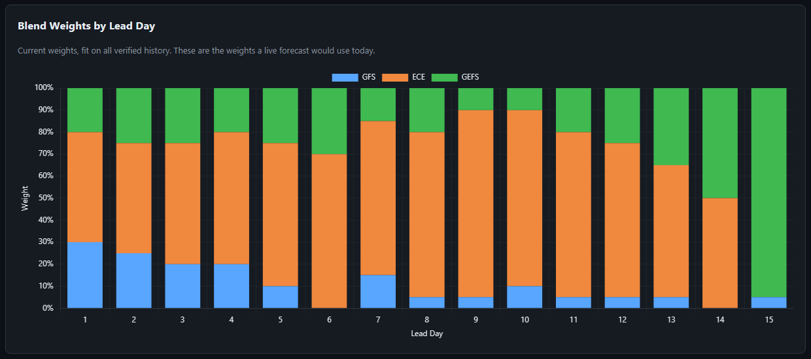

# Blended Weather Forecast Model for Natural Gas Demand

**A forecast that beats every major weather model it's built from.**

U.S. natural gas demand is driven by the weather, and traders forecast it with gas-weighted degree days (GWDD). Three major weather models forecast GWDD: **GFS** (NOAA), **ECMWF Ensemble (ECE)** and **GEFS** (NOAA's ensemble). Each has different strengths at different lead times. This project scores all three against what actually happened, then combines them into one blended forecast that is more accurate than any of them, at every forecast range from 1 to 15 days.

  

## Headline result

Scored out-of-sample on 8,833 forecasts (Jul 2024 – May 2026, two full winters):

| Forecast window | Best single model | Its RMSE | **Blend RMSE** | **Error reduction** |
|---|---|---|---|---|
| 1–5 days | GEFS | 1.200 | **0.884** | **26.3%** |
| 6–10 days | ECE | 2.267 | **2.196** | **3.1%** |
| 11–15 days | ECE | 3.253 | **3.227** | **0.8%** |

At 1–5 days the blend lands within ±1 GWDD of the actual value **82%** of the time, against 64% for the best single model.



## How the blend works

[`blend_model.py`](blend_model.py) fits a separate model for each lead day (1–15 days ahead):

1. **Weighted average.** It learns non-negative weights for GFS, ECE and GEFS that sum to 1, chosen by grid search to minimize squared error. The weights are easy to read and can't overfit into extreme values.
2. **Seasonal bias correction.** All three models consistently forecast too few degree days, and by different amounts in summer and winter. The blend learns a separate correction for each half of the year. This is where most of the 1–5 day gain comes from.
3. **Model selection.** Four methods were compared: equal average, inverse-error weights, optimized weights with one bias correction, and optimized weights with a seasonal bias correction. The seasonal version scored best and is used as the blend.

The learned weights show how much the blend trusts each model at each lead time. It spreads weight across all three in the first few days, then leans heavily on ECE (70–85%) in the 6–12 day range, where ECE is the strongest model:



### Built to avoid look-ahead bias

A blend can look great if it's tuned on the same data it's scored on. This one is tested with a **walk-forward backtest**:

- At the start of each month, the weights are refit using only forecasts whose actual outcome was already known, then applied to that month's forecasts.
- The code asserts that no training row's valid date falls on or after the start of the test period.
- The first 12 months of data are used only for training.
- The single models are scored on exactly the same rows as the blend, so the comparison is like-for-like.

## Model verification findings

Before blending, the project verifies each model on its own. These results cover 43,846 forecasts checked against what actually happened (Oct 2022 – May 2026):

| Forecast window | Best single model | RMSE | Correlation | Within ±1 GWDD |
|---|---|---|---|---|
| 1–5 days | GEFS | 1.18 | 0.992 | 65% |
| 6–10 days | ECE | 2.15 | 0.970 | 44% |
| 11–15 days | ECE | 3.08 | 0.931 | 37% |

- **GFS forecasts too few degree days (too warm) in winter.** In Dec–Feb its bias ranges from −1.4 to −1.75 GWDD across all forecast windows, which matters most when gas demand peaks.
- **ECE gives the most stable forecasts.** Its forecast for a given day changes by 0.17 GWDD on average from one daily run to the next, against 1.28 for GFS, so its signal is less noisy to trade on.
- **Extreme events are underestimated at longer leads.** At Washington Reagan (KDCA), ECE forecasts too many heating degree days for extreme cold out to day 5, then flips to too few from day 7 on, reaching −6.2 HDD by day 14. Extreme heat follows the same pattern.

## Interactive dashboard

`weather_dashboard.html` is a single file with no external dependencies (Chart.js is inlined), so it opens offline in any browser. A PDF export is in [`weather_dashboard.pdf`](weather_dashboard.pdf).

Tabs:
- **Blended model:** results summary, a scorecard comparing every method with every model, error by lead day, and the blend weights
- **Model scorecard:** RMSE, MAE, bias, correlation and hit rate by model and window
- **Forecast vs actual:** time series of each model against what verified
- **Bias & seasonality:** bias by month and season
- **Convergence & revisions:** how forecasts change as the valid date gets closer
- **GFS vs ECE divergence:** what happens when the two models disagree
- **Regime performance:** accuracy in cold, normal and warm conditions
- **Bias by magnitude:** whether errors grow on high-demand days
- **KDCA extreme events:** single-station HDD/CDD bias by lead day for the coldest and hottest 10% of days
- **Market insights:** plain-language takeaways generated from the stats

## Run it

```bash
pip install pandas numpy
python weather_verification.py   # full pipeline: verification + blend + dashboard (~5 s)
python blend_model.py            # blend backtest only
```

`weather_verification.py` loads the forecasts and matches them to observed GWDD. It then computes the verification stats and pattern analysis, runs the KDCA extreme-event analysis and the blend backtest, and renders the dashboard.

| Output | Contents |
|---|---|
| `weather_dashboard.html` | Interactive dashboard |
| `blend_results.csv` | Out-of-sample stats for each blending method and model, by window and by lead day |
| `blend_forecasts.csv` | Each test forecast: the three models, the blend and the actual |
| `blend_weights.csv` | Current blend weights and seasonal bias corrections for each lead day |
| `model_verification_results.csv` | Stats for each model, window, season and month |
| `kdca_extreme_events.csv` | KDCA extreme cold and heat events with forecast error by lead day |

## Data

| File | Description |
|---|---|
| `GFS_GWUS.csv`, `ECE_GWUS.csv`, `GEFS_GWUS.csv` | Daily 00Z model runs: forecast GWDD for U.S. gas-weighted demand, up to 15 days out |
| `GWUS_history.csv` | Observed daily GWDD |
| `ECE_KDCA_t2m_20200101_20251231.csv` | ECE 2 m temperature forecasts for KDCA, 6-hourly steps, 2020–2025 |

ECE runs stop at day 14, so at day 15 the blend uses GFS and GEFS only. The source files contain far fewer forecasts at days 14–15, mostly from summer, so errors at those leads look lower than they really are.
